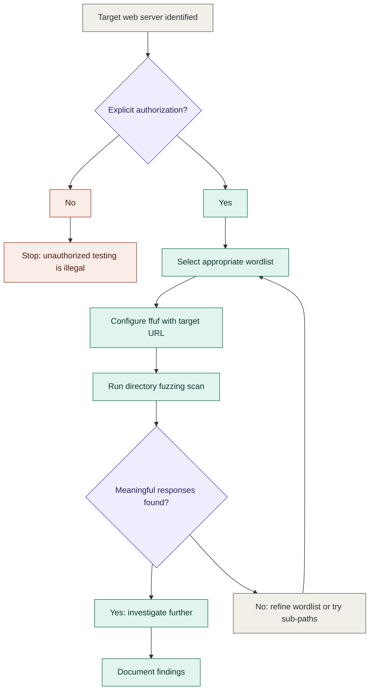

# Mermaid Diagrams Reference

Add a diagram only when it genuinely aids understanding. Not every concept needs
one. Complex attack flows, protocol exchanges, and decision trees benefit from
diagrams. Simple definitions do not.

## When to use which type

- **Flowchart** (`graph TD`): Attack flows, decision logic, scanning methodology
- **Sequence diagram**: Protocol exchanges, request/response cycles
- **State diagram**: Session states, connection states
- **Mind map**: Concept relationships, threat categories
- Other types (timeline, ER, Gantt, quadrant, network graph) as appropriate

## Layout

- `graph TD` (top to bottom) for sequential flows and decision trees
- `graph LR` (left to right) for hierarchical and tree structures

## Colors

Include these four `classDef` definitions in every diagram. Assign every node
exactly one class:

```
classDef danger   fill:#FAECE7,stroke:#993C1D,color:#4A1B0C
classDef action   fill:#E1F5EE,stroke:#0F6E56,color:#04342C
classDef decision fill:#EEEDFE,stroke:#534AB7,color:#26215C
classDef neutral  fill:#F1EFE8,stroke:#5F5E5A,color:#2C2C2A
```

- `danger`: High-risk nodes, attacker-controlled paths, failure states
- `action`: Productive steps, successful outcomes, analyst actions
- `decision`: Branch points, conditional nodes
- `neutral`: Starting points, structural nodes, informational steps

## Obsidian Compatibility

- Wrap in ` ```mermaid ` code blocks
- Use `<br>` for line breaks within nodes (not `\n`)
- Keep node labels concise
- Do not use `%%` comments
- Wrap labels with special characters in double quotes
- Decision nodes: `F{"Label?"}` not `F{Label?}`

## Reference Diagram

Match this exact style in all output diagrams:


