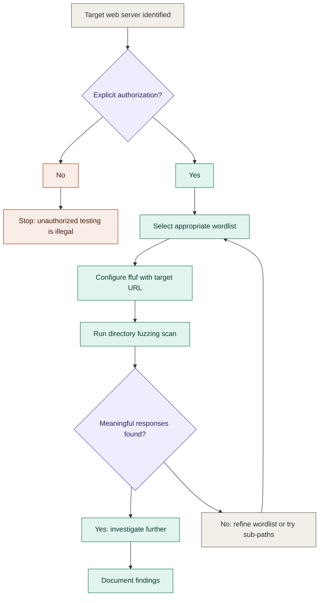
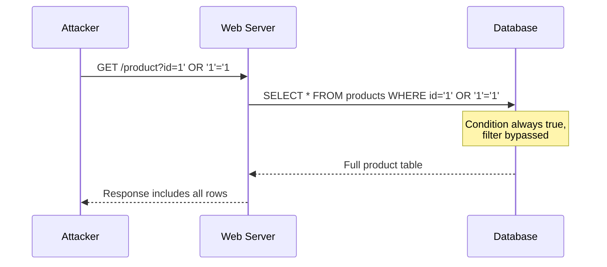
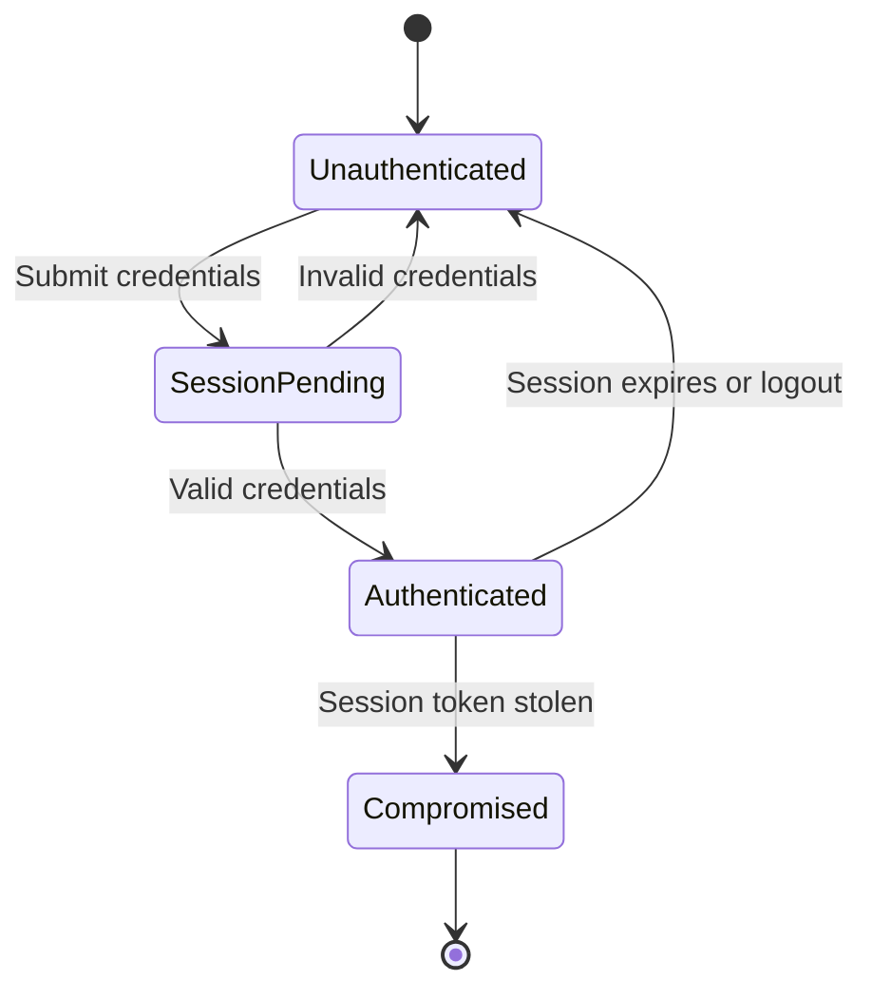

# Mermaid Diagrams Reference

Add a diagram only when it genuinely aids understanding. Not every concept needs
one. Complex attack flows, protocol exchanges, and decision trees benefit from
diagrams. Simple definitions do not.

## When to use which type

- **Flowchart** (`graph TD`): Attack flows, decision logic, scanning methodology
- **Sequence diagram**: Protocol exchanges, request/response cycles
- **State diagram**: Session states, connection states
- **Mind map**: Concept relationships, threat categories
- Other types (timeline, ER, Gantt, quadrant, network graph) as appropriate

## Layout

- `graph TD` (top to bottom) for sequential flows and decision trees
- `graph LR` (left to right) for hierarchical and tree structures

## Colors

Include these four `classDef` definitions in every diagram. Assign every node
exactly one class:

```
classDef danger   fill:#FAECE7,stroke:#993C1D,color:#4A1B0C
classDef action   fill:#E1F5EE,stroke:#0F6E56,color:#04342C
classDef decision fill:#EEEDFE,stroke:#534AB7,color:#26215C
classDef neutral  fill:#F1EFE8,stroke:#5F5E5A,color:#2C2C2A
```

- `danger`: High-risk nodes, attacker-controlled paths, failure states
- `action`: Productive steps, successful outcomes, analyst actions
- `decision`: Branch points, conditional nodes
- `neutral`: Starting points, structural nodes, informational steps

## Obsidian Compatibility

- Wrap in ` ```mermaid ` code blocks
- Use `<br>` for line breaks within nodes (not `\n`)
- Keep node labels concise
- Do not use `%%` comments
- Wrap labels with special characters in double quotes
- Decision nodes: `F{"Label?"}` not `F{Label?}`

## Size Limit

Keep diagrams to roughly 10-12 nodes. If a process genuinely needs more,
split it into two linked diagrams (e.g. "Recon phase" and "Exploitation
phase") rather than one sprawling graph. A diagram that takes longer to
parse than the prose it replaces has failed its purpose.

## When NOT to Diagram

Don't reach for a diagram just because a concept is technical. Skip it when:

- The flow is strictly linear with no branches (3 steps in a row reads
  faster as a numbered list)
- A sequence diagram would show only one request and one response (that's
  a sentence: "the client sends X, the server replies with Y")
- The "relationship" is really just a list of options with no structure
  connecting them (that's a table, not a mind map)

## Color Classes by Diagram Type

The four classes below are shaped for attack-flow flowcharts. Apply them
accordingly per diagram type:

- **Flowchart:** use all four classes as defined.
- **Sequence diagram:** classes don't apply to participants/messages the
  same way. Skip `classDef`/`class` entirely unless a specific message
  represents a failure or attack step worth calling out with `Note over`.
- **State diagram:** map loosely — a compromised/failed state can borrow
  `danger`, a terminal successful state can borrow `action`, but don't
  force every state into a class if it adds noise.

## Reference Diagrams

Match these exact styles in all output diagrams of the corresponding type.

### Flowchart



### Sequence Diagram



### State Diagram


